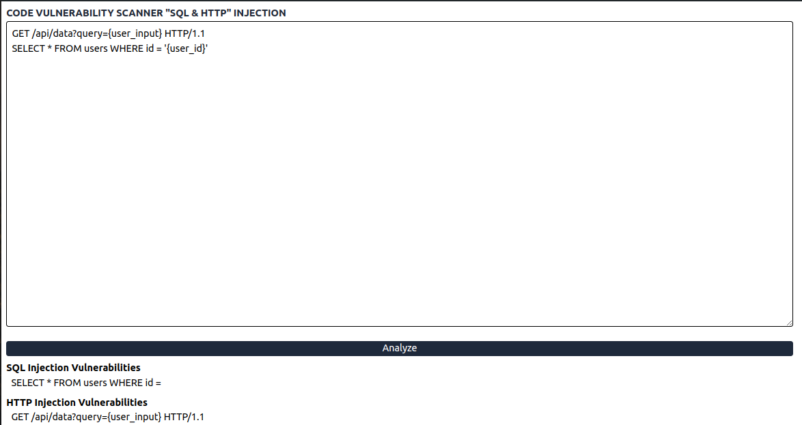

# Code Vulnerability Scanner

Este proyecto es una aplicación web desarrollada en Flask que analiza el código proporcionado por el usuario para detectar posibles vulnerabilidades de inyección SQL y HTTP. La aplicación recibe el código a través de un formulario web, lo analiza y devuelve un informe de posibles vulnerabilidades.

## Requisitos

- Python 3.x
- Flask

## Instalación

1. Clona el repositorio:

```sh
git clone https://github.com/Chris3riel/code-vulnerability-scanner.git
cd code-vulnerability-scanner
```

2. Crea un entorno virtual (opcional pero recomendado):

```sh
python -m venv venv
source venv/bin/activate  # En Windows usa `venv\Scripts\activate`
```

3. Instala las dependencias:

```sh
pip install flask
```

## Estructura del proyecto

```
sql_injection_detector/
│
├── app.py
├── templates/
│   └── index.html
└── analyzers/
    ├── sql_injection.py
    └── http_injection.py
```

## Uso

1. Inicia la aplicación Flask:

```sh
python app.py
```

2. Visita `http://127.0.0.1:5000/` en tu navegador.

3. Pega el código que deseas analizar en el área de texto y haz clic en "Analyze".

## Ejemplos de código

### Ejemplo de código vulnerable a inyección SQL

```python
def get_user_data(user_id):
    query = f"SELECT * FROM users WHERE id = '{user_id}'"
    cursor.execute(query)
    return cursor.fetchall()

user_id = input("Enter user ID: ")
user_data = get_user_data(user_id)
```

### Ejemplo de código vulnerable a inyección HTTP

```python
import requests

def make_request(user_input):
    url = f"http://example.com/api/data?query={user_input}"
    response = requests.get(url)
    return response.json()

user_input = input("Enter your query: ")
response_data = make_request(user_input)
```

## Resultados esperados

Al analizar el código, deberías ver algo como esto en la página:

#### SQL Injection Vulnerabilities
- SELECT * FROM users WHERE id = '{user_id}'

#### HTTP Injection Vulnerabilities
- GET /api/data?query={user_input} HTTP/1.1

## Contribuir

Las contribuciones son bienvenidas. Puedes hacerlo a través de pull requests para mejoras, corrección de errores o adición de nuevas funcionalidades.

1. Haz un fork del repositorio.
2. Crea una rama para tu característica (`git checkout -b feature/nueva-caracteristica`).
3. Realiza tus cambios y haz commits (`git commit -m 'Agrega nueva característica'`).
4. Envía tus cambios (`git push origin feature/nueva-caracteristica`).
5. Abre un pull request.

## Licencia

Este proyecto está bajo la licencia MIT. Ver el archivo `LICENSE` para más detalles.

